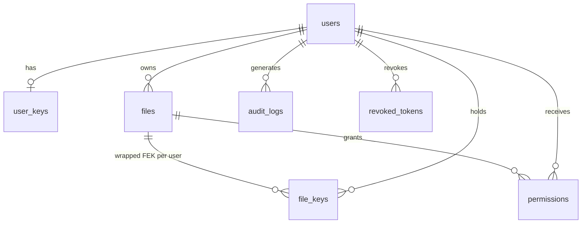

```mermaid
erDiagram
  users ||--o| user_keys : "has"
  users ||--o{ files : "owns"
  files ||--o{ file_keys : "wrapped FEK per user"
  users ||--o{ file_keys : "holds"
  files ||--o{ permissions : "grants"
  users ||--o{ permissions : "receives"
  users ||--o{ audit_logs : "generates"
  users ||--o{ revoked_tokens : "revokes"
```